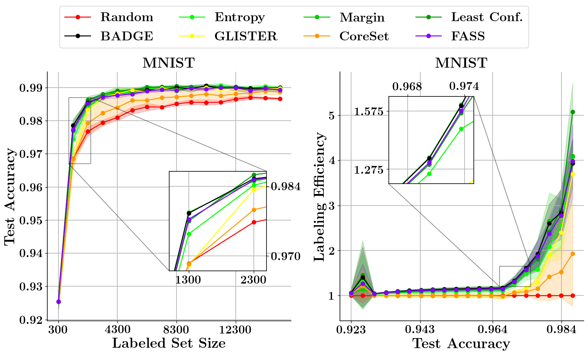

Welcome to DISTIL's documentation!
==================================
DISTIL:: Deep dIverSified inTeractIve Learning is an efficient and scalable active learning library built on top of PyTorch.

**What is DISTIL?**

.. image:: ../../experiment_plots/distil_explanation.png
   :width: 1000px

DISTIL is an active learning toolkit that implements a number of state-of-the-art active learning strategies with a particular focus for active learning in the deep learning setting. DISTIL is built on PyTorch and decouples the training loop from the active learning algorithm, thereby providing flexibility to the user by allowing them to control the training procedure and model. It allows users to incorporate new active learning algorithms easily with minimal changes to their existing code. DISTIL also provides support for incorporating active learning with your custom dataset and allows you to experiment on well-known datasets. We are continuously incorporating newer and better active learning selection strategies into DISTIL.

**Principles of DISTIL**:

#. Minimal changes to add it to the existing training structure.
#. Independent of the training strategy used.
#. Achieving similar test accuracy with less amount of training data.
#. Huge reduction in labeling cost and time.
#. Access to various active learning strategies with just one line of code.

**Preliminary Results**

.. image:: ../../experiment_plots/baseline.png
   :width: 1000px

.. toctree::
   :maxdepth: 2
   :caption: Contents:

   ActStrategy/modules
   configuration

   
   