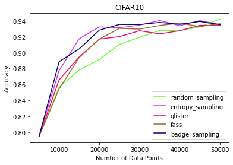
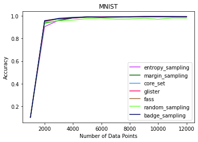
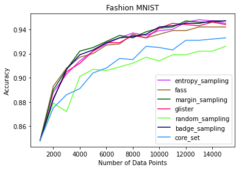
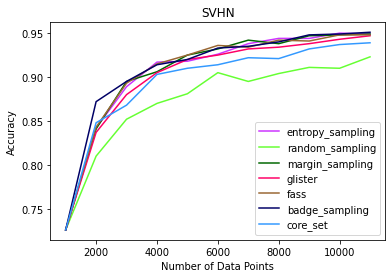

Welcome to DISTIL's documentation!
==================================
DISTIL:: Deep dIverSified inTeractIve Learning is an efficient and scalable active learning library built on top of PyTorch.

**What is DISTIL?**

DISTIL is a toolkit in PyTorch which provides access to different active learning algorithms. Active learning (AL) helps in reducing labeling cost and also reduces training time and resources. AL helps in selecting only the required data, and experiments show that using only 30% of the data for training can reach accuracy levels close to the levels reached when using the entire dataset.

**Principles of DISTIL**:

#. Minimal changes to add it to the existing training structure.
#. Independent of the training strategy used.
#. Achieving similar test accuracy with less amount of training data.
#. Huge reduction in labeling cost and time.
#. Access to various active learning strategies with just one line of code.

**Preliminary Results: CIFAR-10**

**Preliminary Results: MNIST**

**Preliminary Results: Fashion MNIST**

**Preliminary Results: SVHN**

.. toctree::
   :maxdepth: 2
   :caption: Contents:

   ActStrategy/modules
   configuration

   
   